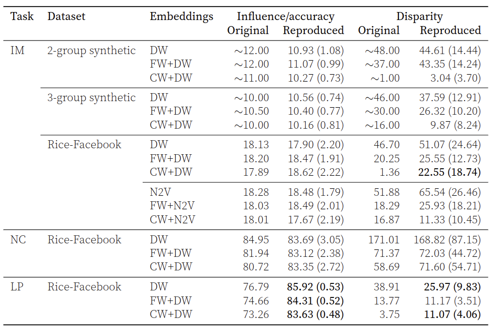
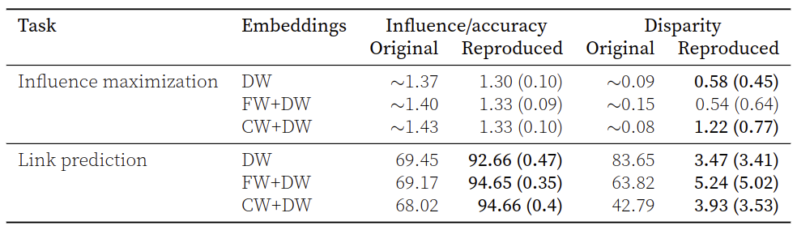

# On the reproducibility of “CrossWalk: Fairness-Enhanced Node Representation Learning”

In this repository, you can find a re-implementation of [CrossWalk: Fairness-Enhanced Node Representation Learning](https://arxiv.org/abs/2105.02725) by Khajehnejad et al. (2022). It can be used to reproduce the results and extend on the ideas of the paper. The repository was created as part of a reproducibility study submitted to [ML Reproducibility Challenge 2022](https://paperswithcode.com/rc2022).

Please cite the original paper if you find this useful:
```
@article{DBLP:journals/corr/abs-2105-02725,
  author    = {Ahmad Khajehnejad and
               Moein Khajehnejad and
               Mahmoudreza Babaei and
               Krishna P. Gummadi and
               Adrian Weller and
               Baharan Mirzasoleiman},
  title     = {CrossWalk: Fairness-enhanced Node Representation Learning},
  journal   = {CoRR},
  volume    = {abs/2105.02725},
  year      = {2021},
  url       = {https://arxiv.org/abs/2105.02725},
  eprinttype = {arXiv},
  eprint    = {2105.02725},
  timestamp = {Fri, 14 May 2021 12:13:30 +0200},
  biburl    = {https://dblp.org/rec/journals/corr/abs-2105-02725.bib},
  bibsource = {dblp computer science bibliography, https://dblp.org}
}
```

## Authors
The following authors have contributed equally:
- Kieron Kretschmar
- Luc Sträter
- Eric Zila
- Jonathan Gerbscheid

# Requirements
## Installation
This code was tested using the environment we provide in `crosswalk.yml`. 
We recommend using that environment to work with the code. Additionally, we recommend installing pytorch seperately, see section below.
```
cd crosswalk_reproduction
conda env create -f crosswalk.yml
conda activate crosswalk
```
### Pytorch
The package makes use of the pytorch framework so please first install pytorch in this new environment according to the official instructions at [https://pytorch.org/get-started/locally/](https://pytorch.org/get-started/locally/). 
We developed the package on pytorch version `1.13.1`, but newer versions are likely also supported.

### Package Installation
The code itself is structured as a package as well. Now that we have setup our environment it is possible to install the reproduction package.
We recommend installing the package as a local package by specificying the `-e .` option to enable further development and access to the data. Run the following command in the root folder of the package.

``` 
pip install -e .
```
#### GLIBCXX error
On Ubuntu you might need to add the path to your conda environment to your `LD_LIBRARY_PATH`. Inside your environment run: 
```
export LD_LIBRARY_PATH=/path/to/anaconda3/envs/crosswalk/lib:$LD_LIBRARY_PATH
```
You can add this line to your `.bashrc` file for a permanent fix.

# Running Instructions
## Reproducing All results
To reproduce the results of the original paper, we only need to the following command:
```
xwalk_reprod --run-all path/to/experiments/folder
```
where `path/to/experiments/folder` is the path to the folder containing the experiment config yml files included in the repository, such as `experiments/node2vec`
This command will iterate through all the configs in the folder and run multiple trials per experiment to calculate average and standard devation. YAML files can be grouped together in folders to do parameter sweeps, see for example `experiments/param_sweeps/rice/alpha_sweep`.

The experiment embeddings, graph and logs can be found in the generated `results\<experiment_number>` folder. The final results will also be written to a csv file in the root directory called `run_all_results_<timestamp>.csv`.

### Individual Experiments
It is also possible to reproduce individual experiments by passing the config file as follows:
```
xwalk_reprod --cfg path/to/experiments/file.yml
```

### Config
Each experiment.yml file contains the relevant parameters for the experiment and use those to overwrite the default arguments found in `config/default.py`. Any parameters not present in the `.yml` file will be pulled form `config/default.py`.

You can also overwrite any of the parameters in the config or the defaults in the command line by passing the `opts` argument:
```
xwalk_reprod --cfg path/to/experiments/file.yml --opts RUNS 2 EMBEDDINGS.EMBEDDING_DIM 32
```
### Notebooks
A notebook for plotting the results from a results `csv` file can be found in the `notebooks` folder. Furthermore we've included the notebook used for generation of 2d Projections and graph visualizations.
# Data
## Datasets
All datasets are included in this repository in the `data/` folder as the datasets are reasonably sized to be included in the repository. 
## Pretrained Embeddings
Pretrained embeddings can be found in `data/embeddings`.
## DGL graphs
While the graphs used in this repo can be read from the source dataset files in `data/immutable`, we have also included the dgl graphs files that can be read directly using dgl.

# Results

We achieve the following reproduction results:


Reproduction results for twitter dataset:

# Libraries Used

### Node embeddings
To replicate the results of the original paper we make use of the [gensim](https://radimrehurek.com/gensim/models/word2vec.html) library. We additionally provide a pytorch implementation of node2vec that can be extended more easily. 

### Graphs
We make use of the [dgl](https://www.dgl.ai/) library for our graphs. This framework is compatible with multiple popular deep learning frameworks such as Pytorch, Tensorflow & MXNet.

# Using the package functions
It is also possible to use the functions of the package by importing it. In this section we will look at a few examples of how to use the functionality provided by the package. Generally more information can be found in the docstring of each function including a description of the function, all its arguments and the output.

### Reading graphs
It is possible to read graphs in .links format and return a [dgl](https://www.dgl.ai/) graph.
```
import crosswalk_reproduction as cr
graph = cr.data_provider.read_graph("path/to/graph/graph.links")
```

### Reweighting graph
Once we have a dgl graph loaded we can apply crosswalk or fairwalk to the weights of the graph as follows:
```
alpha = 0.5 
p = 1
walk_length = 5
walks_per_node = 1000
group_key = 'groups' # key in graph.ndata where protected attribute is stored
prior_weights_key = 'prior_weights' # (optional) key in graph.edata where prior weights are stored

adjusted_weights = cr.preprocessor.get_crosswalk_weights(graph, alpha, p, walk_length, walks_per_node, group_key, prior_weights_key)
# or
adjusted_weights = cr.preprocessor.get_fairwalk_weights(graph, group_key)

graph.edata['adjusted_weights'] = adjusted_weights

```


### Dataset generation

To generate synthetic datasets, run:

```
import crosswalk_reproduction as cr

node_counts = [200, 300]
edge_probabilities = [[0.8, 0.8], [0.8, 0.8]]
self_connection_prob=0.0
directed=True
init_weights_strategy="uniform"   # optional
weight_key="weights"  # optional
remove_isolated=True  # optional
group_key="groups"  # optional

graph = cr.data_provider.synthesize_graph(
                node_counts, 
                edge_probabilities,
                self_connection_prob=self_connection_prob,
                directed=directed,
                init_weights_strategy=init_weights_strategy,
                weight_key=weight_key,
                remove_isolated=remove_isolated,
                group_key=group_key)
```
For more information see the docstring of the function
### Embedding training

To train node embeddings for a DGL graph, run:

```
import crosswalk_reproduction as cr

# define the needed parameters
# - for more information about these parameters check config/defaults.py
embedding_args = {
    "method": "node2vec",
    "embedding_dim": 32,
    "walk_length": 40,
    "context_size": 10,
    "walks_per_node": 80,
    "num_negative_samples": 1,
    "p": 1.0,
    "q": 1.0,
    "num_workers": 4,
    "lr": 0.025,
    "num_epochs": 5,
    "weight_key": 'weights',
    "min_count": 0
}

# read graph
graph = cr.data_provider.read_graph("/path/to/graph/folder/rice_subset.links")

embeddings = cr.node_embeddor.generate_embeddings(graph, embedding_args)

# assign to graph
graph.ndata['embeddings'] = embedding.to(graph.device)

```

## License

All content in the repository is licensed under the MIT license. More information can be found in the [license file](LICENSE).

## Acknowledgements

- [Khajehnejad et al. (2022)](https://arxiv.org/abs/2105.02725) - original paper
- [Papers with code (2020)](https://github.com/paperswithcode/releasing-research-code) - README.md template
